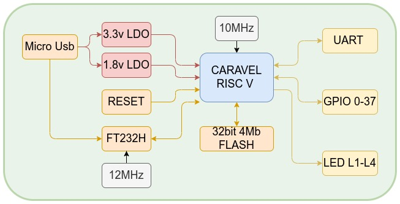
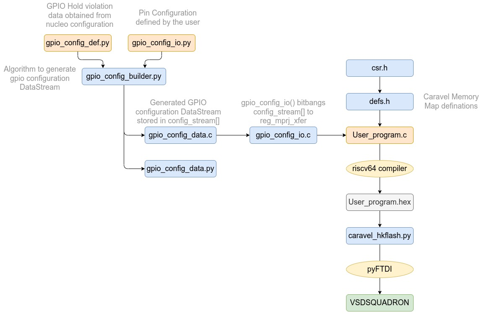

# vsdsquadron documentation


## Mechanical Overview

### Top view

### Bottom view


## Functional Overview

### Block diagram



### Pin Definitions

| pin Header  | Function | Active Low/High)
| ------------- | ------------- |----- |
| J1  | Caravell clock Enable | Active LOW |
| J2  | Micro USB Connector  |
| J3  | UART enable | Active HIGH |
| J4  | UART Header  |
| J5  | FLASH Header  |
| J10  | User LED Input  |
| Caravel brakout | Direct connection to Caravel IC  |

- User can connect the user GPIO Led pin to any caravel pin to see the output

### LED 

| LED  | Function |
| ------------- | ------------- |
| PWR LED | 3.3V OK |
| GPIO LED  | Internal GPIO  |
| RX LED  | FTDI Receive signal |
| TX LED  | FTDI Transmit signal |
| L1| Caravel GPIO 0  |
| L2  | Caravel GPIO 37  |
| L3 | User GPIO 1 |
| L4 | User GPIO 2 |


## Programming 

### Toolchain setup


- Install `PyFTDI` library support. `PyFTDI` relies on `PyUSB`, which requires a native dependency: libusb 1.x.

```
sudo apt-get install libusb-1.0 libusb-1.0-0-dev
sudo pip3 uninstall setuptools
sudo apt-get install python3-setuptools
sudo pip3 install pyftdi
```

- Install the riscv toolchain from:

```
sudo apt-get install gcc-riscv64-unknown-elf
```

In case this does not work, you can get the sources yourself [here](https://github.com/riscv-collab/riscv-gnu-toolchain)

Git clone the caravel_board repository. 

git clone https://github.com/yathAg/vsdsquadron_software.git

### Programming Flow



## Appendix A: Running gpio_test

GPIO test is a simple script to toggle all the GPIOs on the board. The commands below illustrate the process of flashing vsdsquadron with the code.

```
$ cd vsdsquadron_software/firmware/gpio_test
$ make PART=<part_id>
```
- Make sure Jumper J3 is removed
- Power off the vsdsquadron
- Hold the reset button and run power on the device while holding down the button.
- Run the following command while holding down the button, and after running the command, release the button.

```
$ sudo make flash
```

The script should flash the board and complete with the message in Note 1.
This should result in `L1`, `L2`, and `GPIO Led` blinking with a frequency of 2Hz

>**Note** 1
```
python3 ../util/caravel_hkflash.py gpio_test.hex
Success: Found one matching FTDI device at ftdi://ftdi:232h:1:a/1
 
Caravel data:
   mfg        = 0456
   product    = 11
   project ID = 00000000
 
Resetting Flash...
status = 0x00
 
JEDEC = b'ef4016'
Erasing chip...
done
status = 0x0
setting address to 0x0
addr 0x0: flash page write successful
addr 0x100: flash page write successful
addr 0x200: flash page write successful
addr 0x300: flash page write successful
addr 0x400: flash page write successful
addr 0x500: flash page write successful
addr 0x600: flash page write successful
addr 0x700: flash page write successful
addr 0x800: flash page write successful
setting address to 0x900
addr 0x900: flash page write successful

total_bytes = 2552
status reg_1 = 0x0
status reg_2 = 0x2
************************************
verifying...
************************************
status reg_1 = 0x0
status reg_2 = 0x2
setting address to 0x0
addr 0x0: read compare successful
addr 0x100: read compare successful
addr 0x200: read compare successful
addr 0x300: read compare successful
addr 0x400: read compare successful
addr 0x500: read compare successful
addr 0x600: read compare successful
addr 0x700: read compare successful
addr 0x800: read compare successful
setting address to 0x900
addr 0x900: read compare successful

total_bytes = 2552
pll_trim = b'00'

python3 ../util/caravel_hkstop.py
Success: Found one matching FTDI device at ftdi://ftdi:232h:1:a/1
```

## Appendix B: Transmitting data over UART

### Installing and running serial terminal to see messages 

To install picocom 
```
sudo apt install picocom
```

Launch picocom using
```
picocom -b 9600 /dev/serial/by-id/usb-FTDI_Single_RS232-HS-if00-port0
```
- `-b` defines the baud rate
- `/dev/serial/by-id/usb-FTDI_Single_RS232-HS-if00-port0` is the serial id of the board it can also be found using

```
ls /dev/serial/by-id/
```

### Flashing UART code and viewing data
```
$ cd vsdsquadron_software/firmware/uart_test
$ make PART=<part_id>
```
- Make sure Jumper J3 is removed
- Power off the vsdsquadron
- Hold the reset button and run power on the device while holding down the button.
- Run the following command while holding down the button, and after running the command, release the button.

```
$ sudo make flash
```

- Connect J3 & Power Cycle the board ( Turn off and then Turn On)
- Open serial terminal to see the message `Hello from VSDSQUADRON`

## Appendix C: Important VSDsquadron Registers

### GPIO 
reg_gpio_mode1 
reg_gpio_mode0 
reg_gpio_ien 
reg_gpio_oe 
reg_gpio_in 
reg_gpio_out 

### UART 
reg_uart_data
reg_uart_txfull  
reg_uart_rxempty   
reg_uart_enable
reg_uart_irq_en    

### User Project Control 
reg_mprj_xfer 
reg_mprj_pwr  
reg_mprj_irq  
reg_mprj_datal 
reg_mprj_datah 

reg_mprj_io_0 
.
.
reg_mprj_io_37 

### GPIO mode values
- GPIO_MODE_MGMT_STD_INPUT_PULLDOWN
- GPIO_MODE_MGMT_STD_INPUT_PULLUP	 
- GPIO_MODE_MGMT_STD_BIDIRECTIONAL 
- GPIO_MODE_USER_STD_INPUT_PULLDOWN
- GPIO_MODE_USER_STD_INPUT_PULLUP	 
- GPIO_MODE_USER_STD_OUTPUT	     
- GPIO_MODE_USER_STD_BIDIRECTIONAL 
- GPIO_MODE_USER_STD_OUT_MONITORED 
- GPIO_MODE_MGMT_STD_INPUT_NOPULL	  
- GPIO_MODE_MGMT_STD_OUTPUT	      
- GPIO_MODE_MGMT_STD_ANALOG	      
- GPIO_MODE_USER_STD_INPUT_NOPULL	  
- GPIO_MODE_USER_STD_ANALOG	      